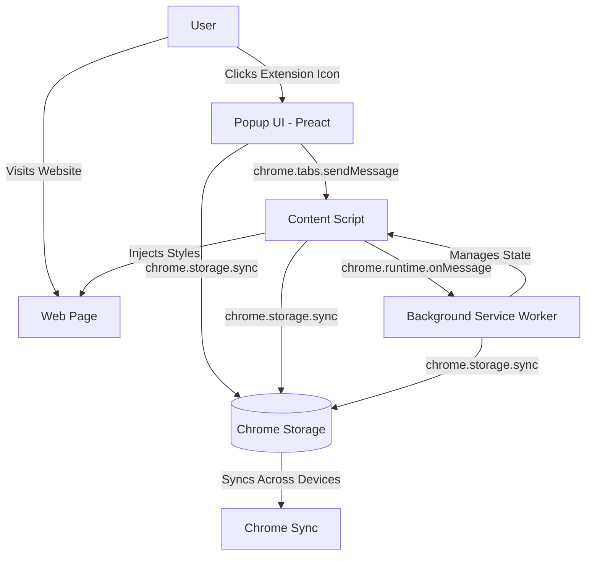

# Design Document

## Overview

The Dark Theme Chrome Extension is a browser extension built with Preact and Vite that enables users to apply customizable dark themes to any website. The extension leverages Chrome's Manifest V3 architecture with a service worker background script, content scripts for DOM manipulation, and a Preact-based popup interface for user controls.

The system architecture follows Chrome's extension model with three main components:
- **Popup UI**: Preact application for user interaction and settings management
- **Content Scripts**: Injected into web pages to apply dark theme styles
- **Background Service Worker**: Manages extension lifecycle and cross-tab state coordination

## Architecture

### High-Level Architecture



### Build System Architecture

The project uses Vite with a custom configuration to generate Chrome extension artifacts:

```
Source Structure:
├── src/
│   ├── popup/
│   │   ├── App.jsx          # Main Preact popup component
│   │   ├── main.jsx          # Popup entry point
│   │   └── popup.html        # Popup HTML template
│   ├── content/
│   │   ├── content.js        # Content script logic
│   │   └── content.css       # Dark theme styles
│   ├── background/
│   │   └── background.js     # Service worker
│   └── assets/
│       └── icons/            # Extension icons
├── public/
│   └── manifest.json         # Extension manifest
└── vite.config.js            # Vite configuration

Build Output (dist/):
├── manifest.json
├── popup.html
├── popup.js
├── content.js
├── content.css
├── background.js
└── assets/
    └── icons/
```

## Components and Interfaces

### 1. Manifest Configuration (manifest.json)

**Purpose**: Defines extension metadata, permissions, and entry points

**Structure**:
```json
{
  "manifest_version": 3,
  "name": "Dark Theme Extension",
  "version": "1.0.0",
  "description": "Apply customizable dark themes to any website",
  "permissions": ["storage", "activeTab", "scripting"],
  "host_permissions": ["<all_urls>"],
  "action": {
    "default_popup": "popup.html",
    "default_icon": {
      "16": "assets/icons/icon-16.png",
      "32": "assets/icons/icon-32.png",
      "48": "assets/icons/icon-48.png",
      "128": "assets/icons/icon-128.png"
    }
  },
  "background": {
    "service_worker": "background.js"
  },
  "content_scripts": [
    {
      "matches": ["<all_urls>"],
      "js": ["content.js"],
      "css": ["content.css"],
      "run_at": "document_start"
    }
  ],
  "icons": {
    "16": "assets/icons/icon-16.png",
    "48": "assets/icons/icon-48.png",
    "128": "assets/icons/icon-128.png"
  }
}
```

**Key Design Decisions**:
- Use `manifest_version: 3` for latest Chrome extension standards
- Set `run_at: "document_start"` to apply dark theme before page renders
- Request `<all_urls>` host permissions to work on all websites
- Use `storage` permission for chrome.storage.sync API

### 2. Popup Component (Preact)

**Purpose**: Provides user interface for controlling dark theme settings

**Component Structure**:
```jsx
<PopupApp>
  ├── <Header />
  ├── <ThemeToggle />          // Main on/off switch
  ├── <IntensitySlider />      // Adjust theme intensity (0-100)
  ├── <CurrentSiteInfo />      // Display current site and status
  └── <SiteListManager />      // Whitelist/blacklist management
      ├── <SiteList type="whitelist" />
      └── <SiteList type="blacklist" />
</PopupApp>
```

**State Management**:
```javascript
import { useState } from 'preact/hooks';

const [darkThemeEnabled, setDarkThemeEnabled] = useState(false);
const [intensity, setIntensity] = useState(80);
const [currentSite, setCurrentSite] = useState('');
const [whitelist, setWhitelist] = useState([]);
const [blacklist, setBlacklist] = useState([]);
```

**Chrome API Integration**:
- `chrome.tabs.query({ active: true, currentWindow: true })` - Get current tab
- `chrome.tabs.sendMessage(tabId, message)` - Send commands to content script
- `chrome.storage.sync.get/set()` - Persist and retrieve settings

**Message Protocol**:
```javascript
// Toggle dark theme
{
  type: 'TOGGLE_DARK_THEME',
  enabled: boolean,
  site: string
}

// Update intensity
{
  type: 'UPDATE_INTENSITY',
  intensity: number (0-100)
}

// Update site list
{
  type: 'UPDATE_SITE_LIST',
  listType: 'whitelist' | 'blacklist',
  sites: string[]
}
```

### 3. Content Script (content.js)

**Purpose**: Applies dark theme styles to web pages and responds to popup commands

**Core Functions**:

```javascript
// Initialize on page load
async function initDarkTheme() {
  const settings = await chrome.storage.sync.get([
    'darkThemeEnabled',
    'intensity',
    'whitelist',
    'blacklist',
    'siteSettings'
  ]);
  
  const currentSite = window.location.hostname;
  const shouldApply = determineShouldApply(currentSite, settings);
  
  if (shouldApply) {
    applyDarkTheme(settings.intensity);
  }
}

// Apply dark theme
function applyDarkTheme(intensity) {
  document.documentElement.classList.add('dark-theme-active');
  document.documentElement.style.setProperty('--dark-theme-intensity', intensity / 100);
}

// Remove dark theme
function removeDarkTheme() {
  document.documentElement.classList.remove('dark-theme-active');
}

// Message listener
chrome.runtime.onMessage.addListener((message, sender, sendResponse) => {
  switch (message.type) {
    case 'TOGGLE_DARK_THEME':
      if (message.enabled) {
        applyDarkTheme(message.intensity || 80);
      } else {
        removeDarkTheme();
      }
      saveSiteSettings(message);
      break;
      
    case 'UPDATE_INTENSITY':
      updateIntensity(message.intensity);
      break;
  }
  sendResponse({ success: true });
});
```

**Site Preference Logic**:
```javascript
function determineShouldApply(site, settings) {
  // Check blacklist first (highest priority)
  if (settings.blacklist?.includes(site)) {
    return false;
  }
  
  // Check whitelist
  if (settings.whitelist?.includes(site)) {
    return true;
  }
  
  // Check site-specific settings
  if (settings.siteSettings?.[site]?.enabled !== undefined) {
    return settings.siteSettings[site].enabled;
  }
  
  // Default to global setting
  return settings.darkThemeEnabled || false;
}
```

### 4. Dark Theme Styles (content.css)

**Purpose**: CSS rules for dark theme appearance

**Design Strategy**:
- Use CSS custom properties for dynamic intensity control
- Apply styles only when `.dark-theme-active` class is present
- Use high specificity and `!important` to override site styles
- Protect media elements from over-inversion

**Core Styles**:
```css
:root {
  --dark-theme-intensity: 0.8;
  --dark-bg: hsl(0, 0%, calc(10% * var(--dark-theme-intensity)));
  --dark-text: hsl(0, 0%, calc(90% + (10% * (1 - var(--dark-theme-intensity)))));
  --dark-border: hsl(0, 0%, calc(30% * var(--dark-theme-intensity)));
}

.dark-theme-active {
  background-color: var(--dark-bg) !important;
  color: var(--dark-text) !important;
}

.dark-theme-active *:not(img):not(video):not(canvas) {
  background-color: var(--dark-bg) !important;
  color: var(--dark-text) !important;
  border-color: var(--dark-border) !important;
}

/* Input elements */
.dark-theme-active input,
.dark-theme-active textarea,
.dark-theme-active select {
  background-color: hsl(0, 0%, 15%) !important;
  color: var(--dark-text) !important;
  border: 1px solid var(--dark-border) !important;
}

/* Links */
.dark-theme-active a {
  color: hsl(210, 100%, 70%) !important;
}

.dark-theme-active a:visited {
  color: hsl(270, 100%, 70%) !important;
}

/* Protect media from inversion */
.dark-theme-active img,
.dark-theme-active video,
.dark-theme-active canvas {
  filter: brightness(calc(0.8 + (0.2 * (1 - var(--dark-theme-intensity)))));
}

/* Buttons */
.dark-theme-active button {
  background-color: hsl(0, 0%, 20%) !important;
  color: var(--dark-text) !important;
  border: 1px solid var(--dark-border) !important;
}
```

**Intensity Implementation**:
The intensity value (0-100) is converted to a CSS custom property (0-1) that scales:
- Background darkness (darker at higher intensity)
- Text brightness (brighter at higher intensity)
- Media brightness adjustment (less dimming at lower intensity)

### 5. Background Service Worker (background.js)

**Purpose**: Manages extension lifecycle, coordinates state across tabs, and handles installation

**Core Responsibilities**:

```javascript
// Installation handler
chrome.runtime.onInstalled.addListener((details) => {
  if (details.reason === 'install') {
    // Set default settings
    chrome.storage.sync.set({
      darkThemeEnabled: false,
      intensity: 80,
      whitelist: [],
      blacklist: [],
      siteSettings: {}
    });
  } else if (details.reason === 'update') {
    // Handle settings migration if needed
    migrateSettings(details.previousVersion);
  }
});

// Message relay between popup and content scripts
chrome.runtime.onMessage.addListener((message, sender, sendResponse) => {
  if (message.type === 'BROADCAST_SETTINGS') {
    // Broadcast settings change to all tabs
    chrome.tabs.query({}, (tabs) => {
      tabs.forEach(tab => {
        chrome.tabs.sendMessage(tab.id, message).catch(() => {
          // Tab may not have content script, ignore error
        });
      });
    });
  }
  sendResponse({ success: true });
});

// Storage change listener for cross-tab sync
chrome.storage.onChanged.addListener((changes, areaName) => {
  if (areaName === 'sync') {
    // Notify all tabs of settings changes
    chrome.tabs.query({}, (tabs) => {
      tabs.forEach(tab => {
        chrome.tabs.sendMessage(tab.id, {
          type: 'SETTINGS_UPDATED',
          changes: changes
        }).catch(() => {});
      });
    });
  }
});
```

### 6. Vite Configuration

**Purpose**: Configure build process for Chrome extension output

**Key Configuration**:
```javascript
import { defineConfig } from 'vite';
import preact from '@preact/preset-vite';
import { resolve } from 'path';

export default defineConfig({
  plugins: [preact()],
  build: {
    rollupOptions: {
      input: {
        popup: resolve(__dirname, 'src/popup/popup.html'),
        content: resolve(__dirname, 'src/content/content.js'),
        background: resolve(__dirname, 'src/background/background.js'),
      },
      output: {
        entryFileNames: '[name].js',
        chunkFileNames: '[name].js',
        assetFileNames: '[name].[ext]'
      }
    },
    outDir: 'dist',
    emptyOutDir: true
  },
  publicDir: 'public'
});
```

**Build Process**:
1. Vite processes React components for popup
2. Bundles content script and background script separately
3. Copies manifest.json and assets from public/ to dist/
4. Generates separate JS files (no code splitting for extension compatibility)

## Data Models

### Storage Schema

All data is stored in `chrome.storage.sync` for cross-device synchronization:

```typescript
interface ExtensionSettings {
  // Global dark theme state
  darkThemeEnabled: boolean;
  
  // Theme intensity (0-100)
  intensity: number;
  
  // Sites that always get dark theme
  whitelist: string[];
  
  // Sites that never get dark theme
  blacklist: string[];
  
  // Per-site settings (overrides global)
  siteSettings: {
    [hostname: string]: {
      enabled: boolean;
      intensity?: number;
      lastModified: number;
    }
  };
}
```

**Storage Limits**:
- chrome.storage.sync has a quota of 100KB total
- Individual items limited to 8KB
- Maximum 512 items

**Storage Strategy**:
- Use hostname (not full URL) as site identifier
- Store only essential data to stay within limits
- Implement cleanup for old site settings if needed

## Error Handling

### Content Script Errors

**Scenario**: Content script fails to inject or execute
- **Detection**: Try-catch blocks around DOM manipulation
- **Recovery**: Log error to console, fail gracefully without breaking page
- **User Impact**: Dark theme won't apply, but page remains functional

**Scenario**: Storage API fails
- **Detection**: Catch promise rejections from chrome.storage calls
- **Recovery**: Use in-memory fallback values
- **User Impact**: Settings won't persist, but extension remains functional

### Popup Errors

**Scenario**: Cannot communicate with content script
- **Detection**: chrome.tabs.sendMessage returns error
- **Recovery**: Display user-friendly message in popup
- **User Impact**: User informed that dark theme cannot be toggled on current page

**Scenario**: Invalid tab or restricted page (chrome://, chrome-extension://)
- **Detection**: Check tab.url before sending messages
- **Recovery**: Display message that extension cannot run on this page
- **User Impact**: Clear communication about limitations

### Background Worker Errors

**Scenario**: Service worker terminated by Chrome
- **Detection**: Automatic restart by Chrome
- **Recovery**: Re-register event listeners on startup
- **User Impact**: Minimal, Chrome handles lifecycle automatically

**Error Logging Strategy**:
```javascript
function logError(context, error) {
  console.error(`[Dark Theme Extension] ${context}:`, error);
  // Could extend to send to analytics service if needed
}
```

## Testing Strategy

### Unit Testing

**Popup Components**:
- Test Preact components with Preact Testing Library
- Mock chrome.* APIs using jest.mock()
- Test state management and user interactions
- Verify message sending logic

**Content Script Functions**:
- Test determineShouldApply() logic with various site configurations
- Test intensity calculation and CSS variable updates
- Mock chrome.storage and chrome.runtime APIs

**Example Test**:
```javascript
describe('determineShouldApply', () => {
  it('should return false for blacklisted sites', () => {
    const settings = {
      darkThemeEnabled: true,
      blacklist: ['example.com']
    };
    expect(determineShouldApply('example.com', settings)).toBe(false);
  });
  
  it('should return true for whitelisted sites', () => {
    const settings = {
      darkThemeEnabled: false,
      whitelist: ['example.com']
    };
    expect(determineShouldApply('example.com', settings)).toBe(true);
  });
});
```

### Integration Testing

**Extension Loading**:
- Load unpacked extension in Chrome
- Verify manifest.json is valid
- Confirm all resources load without errors

**End-to-End Flows**:
1. Install extension → verify default settings
2. Toggle dark theme on test site → verify styles applied
3. Adjust intensity → verify visual changes
4. Add site to whitelist → verify persistence
5. Close and reopen browser → verify settings synced

### Manual Testing Checklist

- [ ] Extension loads without errors in chrome://extensions
- [ ] Popup opens and displays correctly
- [ ] Dark theme toggles on/off on various websites
- [ ] Intensity slider updates theme in real-time
- [ ] Whitelist/blacklist functionality works
- [ ] Settings persist after browser restart
- [ ] Settings sync across Chrome instances (different devices)
- [ ] Extension works on various site types (static, SPA, complex layouts)
- [ ] No console errors on popular websites
- [ ] Performance impact is minimal (no noticeable lag)

### Browser Compatibility Testing

**Target**: Chrome 96+ (Manifest V3 support)

**Test Sites**:
- Static HTML sites
- Preact/React/Vue/Angular SPAs
- Sites with complex CSS (Gmail, Twitter, GitHub)
- Sites with dark mode already (ensure no conflicts)
- Sites with iframes
- Sites with shadow DOM

## Performance Considerations

### Content Script Performance

**Optimization Strategies**:
- Apply styles at `document_start` to prevent flash of unstyled content
- Use CSS custom properties for dynamic updates (no style recalculation)
- Minimize DOM queries by caching selectors
- Use event delegation instead of multiple listeners

**Performance Metrics**:
- Content script execution time: < 50ms
- Style application time: < 100ms
- Memory footprint: < 5MB per tab

### Storage Performance

**Optimization Strategies**:
- Batch storage writes to reduce API calls
- Cache frequently accessed settings in memory
- Debounce intensity slider updates before saving

```javascript
// Debounced storage update
const debouncedSave = debounce((key, value) => {
  chrome.storage.sync.set({ [key]: value });
}, 500);
```

## Security Considerations

### Content Security Policy

The extension follows Chrome's default CSP for Manifest V3:
- No inline scripts in popup.html
- No eval() or new Function()
- All scripts loaded from extension package

### XSS Prevention

- Sanitize any user input (site URLs) before storage
- Use textContent instead of innerHTML when displaying user data
- Validate message sources in chrome.runtime.onMessage

### Permission Justification

- `storage`: Required for saving user preferences
- `activeTab`: Required for applying dark theme to current tab
- `scripting`: Required for programmatic script injection (if needed)
- `<all_urls>`: Required to apply dark theme to any website user visits

## Future Enhancements

Potential features for future iterations:
- Custom color schemes (not just dark)
- Per-element customization
- Import/export settings
- Keyboard shortcuts
- Automatic dark theme based on time of day
- Smart detection of sites that already have dark mode
- Performance monitoring and optimization suggestions
